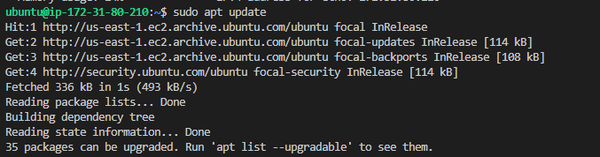
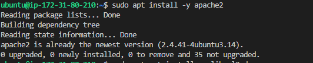
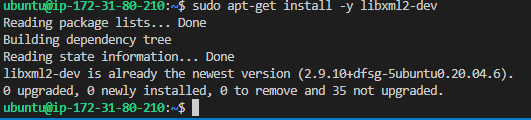
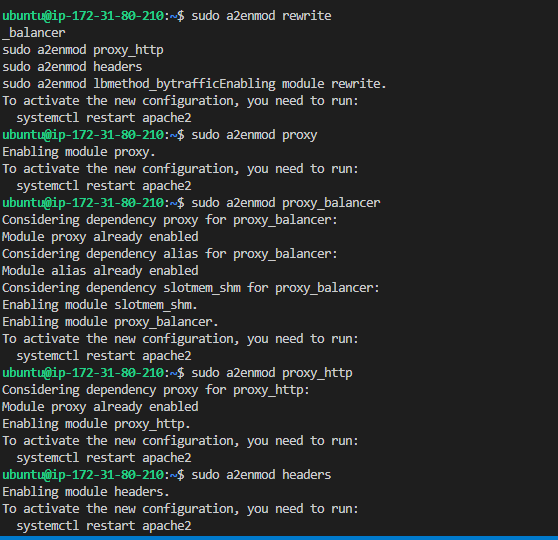
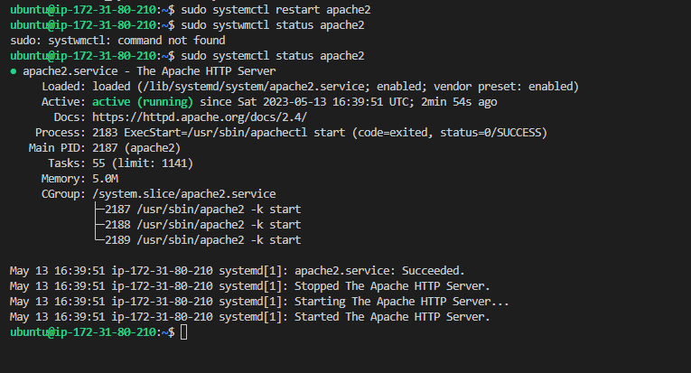
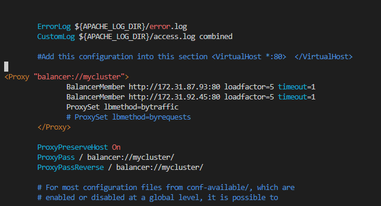
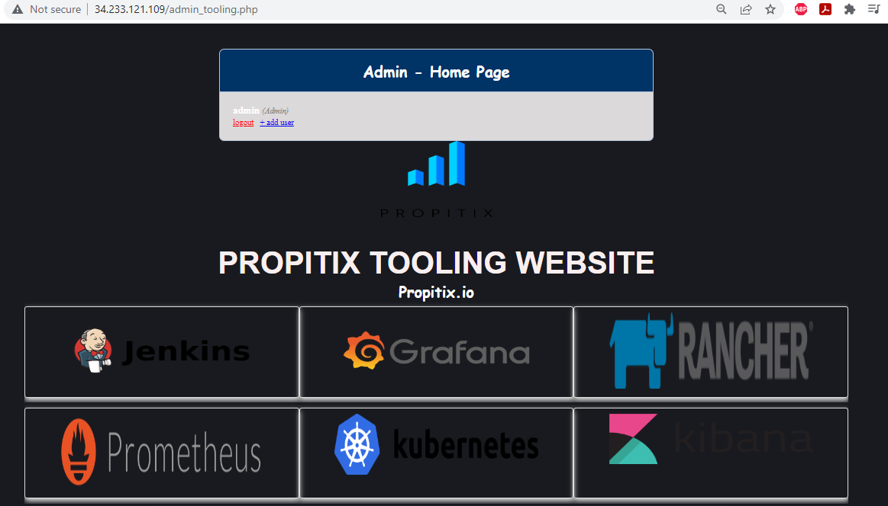
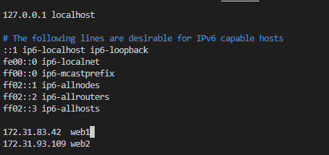
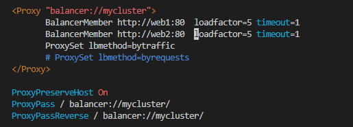
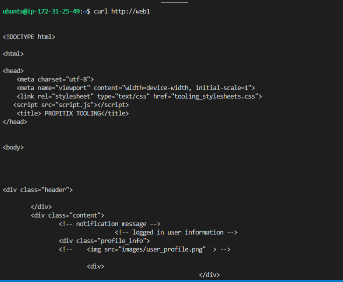

## Documentation for Project 8
## LOAD BALANCER SOLUTION WITH APACHE
## The 3-Tier Web Application Architecture with single database, NFS Server as a shared files storage + Load Blanacer - Apache, (Including the numbers of Web servers =2).

## STEP 1 — CONFIGURE APACHE AS A LOAD BALANCER

-- This is a sequel to Project 7. (2 - Web Server - as client Server, 1 - DB Server -To serve as client Request, 1 - NFS Web Server - Used as shared files Storage, 1 Apache server - Acting as the load balancer) labelled "P8 Apache-LB. Also sinning up an Ubuntu 20.04 Linux server for Apache Load Balance Server in aws EC2.

`sudo apt update -y`--(Updating Web server with ubuntu packages)

`sudo apt install -y apache2`--(Running command to install apache2 using ubuntu Package manager.)

`sudo apt install -y libxml2-dev`--(Using ubuntu package manager to install apache dependencies from apache library.)

`sudo a2enmod rewrite` ; `sudo a2enmod proxy` ; `sudo a2enmod proxy_balancer` ; `sudo a2enmod proxy_http` ; `sudo a2enmod headers` ; `sudo a2enmod lbmethod_bytraffic`--(Enable the following modules)

`sudo systemctl restart apache2`; `sudo systemctl status apache2`--(Restart Apache Service - The Apache HTTP Server to ensure apache2 is up and running)

`sudo vi /etc/apache2/sites-available/000-default.conf`--(Using the vi text editor to open and Configure load balancing file, adding given snippet line of instruction, then amend the load balancer with webserver 1 and web server 2 Private IP Addresses)

`http://34.233.121.109/admin_tooling.php`--(Using load balancer Public IP address on the web browser to launch tooling website, we can now view same tooling website. )

## Optional step
`sudo vi /etc/hosts`--(Using the domain name resolutioin, enables mapping 'web server 1' and 'web server 2' Private IP address to domain name. using the vi text editor  to open the '/etc/hosts' configfile to configure the private servers ip addresses to domain names. )

`sudo vi /etc/apache2/sites-available/000-default.conf`--(Using the vi text editor to open the apache site-available defaults config file Configure for load balancer server, amend private IP address with mapped domain names for webserver 1 (web1) and web server 2 (web2)).

`curl http://web1` ;`curl http://web2`--(curling our client url locally using both domame names or dns name works, we can see the html formate displayed on the teminal for our apache load balancer).
(./Image-8/LB-Curl-DnsName-10b.PNG)

